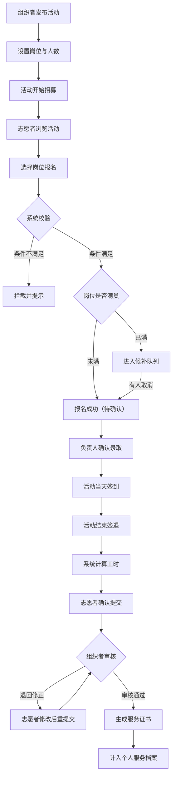

# 志愿者活动招募与工时认证系统 PRD

## 1. 产品概述

志愿者活动招募与工时认证系统是一个面向组织方和志愿者的全流程管理平台，支持活动发布、岗位招募、签到签退、工时审核及证书生成，解决志愿服务管理中信息不透明、工时认证难、证书易伪造等问题。

- 目标用户：活动组织者、岗位负责人、普通志愿者
- 核心价值：全流程数字化管理、工时自动核算、证书可信可验、数据持久可追溯

## 2. 核心功能

### 2.1 用户角色

| 角色 | 注册方式 | 核心权限 |
|------|----------|----------|
| 志愿者 | 账号注册 | 浏览活动、报名/候补、签到签退、查看个人档案、导出工时、申请证书 |
| 组织者 | 管理员创建 | 发布活动、管理岗位、确认到岗、审核工时、生成/撤销证书、查看导出历史 |
| 负责人 | 组织者指定 | 确认签到、登记时长、初审工时（不可审核自己） |

### 2.2 功能模块

1. **活动看板页**：活动列表、筛选搜索、岗位余量展示、活动状态标签
2. **活动详情页**：岗位信息、报名按钮、候补队列、服务时段
3. **个人服务档案页**：报名记录、签到记录、工时统计、证书列表
4. **工时导出页**：按条件筛选、导出CSV、导出历史记录
5. **组织者管理后台**：活动管理、岗位管理、报名审核、工时审核、证书管理

### 2.3 页面详情

| 页面名称 | 模块名称 | 功能描述 |
|---------|----------|----------|
| 活动看板页 | 活动列表卡片 | 展示活动封面、名称、时间、地点、状态、岗位总数/已报数 |
| 活动看板页 | 筛选搜索 | 按状态、时间、关键词筛选活动 |
| 活动详情页 | 岗位列表 | 展示各岗位名称、人数需求、已报/候补数、岗位要求 |
| 活动详情页 | 报名/候补 | 志愿者报名，满员后自动进入候补队列 |
| 活动详情页 | 签到签退 | 负责人确认到岗，记录签到/签退时间 |
| 个人服务档案页 | 报名记录 | 展示所有报名记录及状态（已录取/候补中/已取消） |
| 个人服务档案页 | 工时统计 | 按活动、月份维度统计服务时长 |
| 个人服务档案页 | 我的证书 | 展示已生成的证书及编号 |
| 工时导出页 | 导出筛选 | 按活动、时间范围、审核状态筛选 |
| 工时导出页 | 导出列表 | 导出包含：活动名称、岗位、审核状态、证书编号、生成时间 |
| 工时导出页 | 导出历史 | 记录所有导出操作，可复查 |
| 组织者后台 | 活动管理 | 创建/编辑/发布/结束活动 |
| 组织者后台 | 岗位管理 | 添加岗位、设置人数、岗位要求 |
| 组织者后台 | 报名管理 | 查看报名/候补列表、确认录取 |
| 组织者后台 | 工时审核 | 审核工时、退回修正、通过确认 |
| 组织者后台 | 证书管理 | 生成证书、撤销证书、证书编号管理 |

## 3. 核心流程

### 3.1 活动发布与报名流程

组织者发布活动和岗位 → 志愿者浏览活动 → 选择岗位报名 → 系统校验（岗位条件、时段冲突、活动状态）→ 校验通过报名成功/满员进入候补 → 负责人确认录取

### 3.2 签到签退与工时审核流程

活动开始 → 负责人确认签到 → 活动结束 → 负责人确认签退 → 系统自动计算工时 → 志愿者确认提交 → 负责人/组织者审核 → 审核通过/退回修正 → 审核通过后生成证书

### 3.3 核心流程 Mermaid 图

### 3.4 拦截规则

1. **岗位条件拦截**：未满足岗位要求（如年龄、技能、经验）的志愿者无法报名
2. **时段冲突拦截**：同一时段已报名其他活动的志愿者无法重复报名
3. **签退时间拦截**：签退时间早于签到时间时拦截并提示
4. **自审核拦截**：负责人不能审核自己的工时记录
5. **活动结束拦截**：活动结束后禁止继续报名

## 4. 用户界面设计

### 4.1 设计风格

- **主色调**：深青色（#0D9488）— 代表信任、公益、专业
- **辅助色**：暖橙色（#F97316）— 用于强调操作、状态提示
- **成功色**：翠绿色（#10B981）— 审核通过、签到成功
- **警告色**：琥珀色（#F59E0B）— 待审核、候补中
- **错误色**：玫红色（#EF4444）— 审核退回、报名失败
- **中性色**：石板灰系列 — 文字、背景、边框

- **按钮风格**：圆角中等（rounded-lg），主按钮有微悬浮效果，按压缩放反馈
- **字体**：标题使用 Noto Serif SC（优雅衬线），正文使用 Inter（现代无衬线）
- **布局风格**：卡片式布局 + 顶部导航栏，信息层次分明
- **图标风格**：Lucide 线性图标，统一 1.5px 线条粗细

### 4.2 页面设计概览

| 页面名称 | 模块名称 | UI 元素 |
|---------|----------|---------|
| 活动看板页 | 顶部导航 | Logo、角色切换、个人中心入口、搜索框 |
| 活动看板页 | 活动卡片网格 | 卡片悬浮上浮、渐变封面、状态徽标、人数进度条 |
| 活动看板页 | 筛选侧边栏 | 状态筛选、时间筛选、类型筛选 |
| 活动详情页 | 活动头部 | 大图封面、活动标题、时间地点、状态标签 |
| 活动详情页 | 岗位列表 | 岗位卡片、人数进度条、报名/候补按钮 |
| 活动详情页 | 签到面板 | 签到二维码区域、签到状态、签退按钮 |
| 个人档案页 | 个人信息卡 | 头像、姓名、累计时长、证书数量 |
| 个人档案页 | 工时统计图表 | 月度时长柱状图、活动类型饼图 |
| 个人档案页 | 记录列表 | Tab切换（报名/签到/证书）、时间线样式 |
| 组织者后台 | 侧边导航 | 活动管理、岗位管理、报名审核、工时审核、证书管理 |
| 组织者后台 | 数据概览 | 统计卡片、关键指标数字 |
| 工时导出页 | 导出表单 | 日期范围选择、活动选择、状态筛选 |
| 工时导出页 | 导出历史 | 历史记录表格、下载按钮 |

### 4.3 响应式设计

- **桌面优先**：以 1440px 宽度为基准设计
- **平板适配**：侧边栏折叠为图标模式，卡片网格调整为 2 列
- **手机适配**：底部导航栏，卡片单列布局，表格改为卡片列表
- **触控优化**：按钮最小 44px 触控区域，列表项增加点击热区

### 4.4 动效设计

- **页面入场**：内容区域渐入 + 轻微上移，stagger 延迟
- **卡片悬浮**：上移 4px + 阴影加深，过渡 0.2s
- **按钮交互**：hover 时背景色加深，active 时缩放 0.98
- **状态切换**：平滑过渡动画，如进度条填充、数字滚动
- **加载状态**：骨架屏 + 脉冲动画
