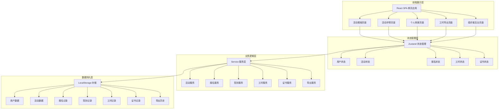
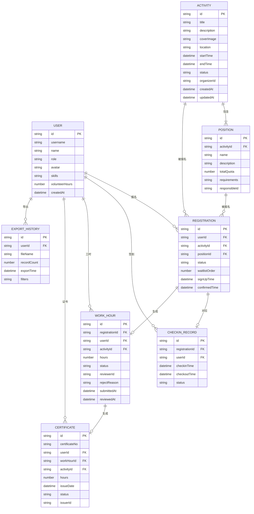

# 志愿者活动招募与工时认证系统 技术架构文档

## 1. 架构设计



## 2. 技术选型说明

- **前端框架**：React@18 + TypeScript
- **构建工具**：Vite@5
- **样式方案**：TailwindCSS@3
- **状态管理**：Zustand
- **路由管理**：React Router@6
- **图标库**：Lucide React
- **数据存储**：LocalStorage（前端持久化，重启后数据可复查）
- **日期处理**：date-fns
- **图表库**：recharts（工时统计图表）
- **CSV导出**：papaparse

## 3. 目录结构

```
src/
├── assets/              # 静态资源
├── components/          # 公共组件
│   ├── layout/         # 布局组件
│   ├── ui/             # UI基础组件
│   └── features/       # 业务组件
├── pages/              # 页面组件
│   ├── Dashboard/      # 活动看板
│   ├── ActivityDetail/ # 活动详情
│   ├── Profile/        # 个人档案
│   ├── Export/         # 工时导出
│   └── Admin/          # 组织者后台
├── store/              # Zustand状态管理
│   ├── useUserStore.ts
│   ├── useActivityStore.ts
│   ├── useRegistrationStore.ts
│   ├── useTimeStore.ts
│   └── useCertificateStore.ts
├── services/           # 业务服务层
│   ├── activityService.ts
│   ├── registrationService.ts
│   ├── checkinService.ts
│   ├── workHourService.ts
│   ├── certificateService.ts
│   └── exportService.ts
├── types/              # TypeScript类型定义
│   ├── index.ts
│   ├── user.ts
│   ├── activity.ts
│   ├── registration.ts
│   ├── workHour.ts
│   └── certificate.ts
├── utils/              # 工具函数
│   ├── storage.ts
│   ├── date.ts
│   ├── validator.ts
│   └── idGenerator.ts
├── data/               # Mock数据
│   └── mockData.ts
├── hooks/              # 自定义Hooks
├── App.tsx
├── main.tsx
└── index.css
```

## 4. 路由定义

| 路由路径 | 页面名称 | 访问权限 |
|---------|----------|----------|
| `/` | 活动看板页 | 所有用户 |
| `/activity/:id` | 活动详情页 | 所有用户 |
| `/profile` | 个人服务档案页 | 登录用户 |
| `/export` | 工时导出页 | 登录用户 |
| `/admin` | 组织者后台首页 | 组织者/负责人 |
| `/admin/activities` | 活动管理 | 组织者 |
| `/admin/activities/new` | 新建活动 | 组织者 |
| `/admin/activities/:id/edit` | 编辑活动 | 组织者 |
| `/admin/registrations` | 报名审核 | 组织者/负责人 |
| `/admin/workhours` | 工时审核 | 组织者/负责人 |
| `/admin/certificates` | 证书管理 | 组织者 |

## 5. 数据模型

### 5.1 ER图



### 5.2 核心枚举值

**活动状态 (ActivityStatus)**
- `draft` - 草稿
- `recruiting` - 招募中
- `ongoing` - 进行中
- `ended` - 已结束
- `cancelled` - 已取消

**报名状态 (RegistrationStatus)**
- `pending` - 待确认
- `confirmed` - 已确认（录取）
- `waitlist` - 候补中
- `cancelled` - 已取消
- `rejected` - 已拒绝

**签到状态 (CheckinStatus)**
- `not_started` - 未开始
- `checked_in` - 已签到
- `checked_out` - 已签退
- `absent` - 缺勤

**工时审核状态 (WorkHourStatus)**
- `draft` - 草稿
- `pending` - 待审核
- `approved` - 已通过
- `rejected` - 已退回

**用户角色 (UserRole)**
- `volunteer` - 志愿者
- `manager` - 负责人
- `organizer` - 组织者

## 6. 核心业务规则与拦截逻辑

### 6.1 报名拦截规则

```typescript
// 1. 活动结束拦截
function validateActivityEnd(activity: Activity): boolean {
  return activity.status !== 'ended' && activity.status !== 'cancelled';
}

// 2. 时段冲突拦截
function validateTimeConflict(userId: string, activity: Activity): boolean {
  const registrations = getUserRegistrations(userId);
  return !registrations.some(reg => 
    reg.status === 'confirmed' && 
    isTimeOverlap(reg.activity, activity)
  );
}

// 3. 岗位条件拦截
function validatePositionRequirements(user: User, position: Position): boolean {
  // 检查用户技能是否满足岗位要求
  return position.requirements.every(req => 
    user.skills.includes(req)
  );
}
```

### 6.2 签退拦截规则

```typescript
// 签退时间不能早于签到时间
function validateCheckoutTime(checkinTime: Date, checkoutTime: Date): boolean {
  return checkoutTime > checkinTime;
}
```

### 6.3 自审核拦截规则

```typescript
// 负责人不能审核自己的工时
function validateSelfReview(reviewerId: string, workHour: WorkHour): boolean {
  return reviewerId !== workHour.userId;
}
```

## 7. 本地存储设计

使用 LocalStorage 进行数据持久化，所有数据以 JSON 格式存储，键名统一前缀 `volunteer_app_`：

| 存储键名 | 数据类型 | 说明 |
|---------|----------|------|
| `volunteer_app_users` | User[] | 用户列表 |
| `volunteer_app_activities` | Activity[] | 活动列表 |
| `volunteer_app_positions` | Position[] | 岗位列表 |
| `volunteer_app_registrations` | Registration[] | 报名记录 |
| `volunteer_app_checkins` | CheckinRecord[] | 签到记录 |
| `volunteer_app_workhours` | WorkHour[] | 工时记录 |
| `volunteer_app_certificates` | Certificate[] | 证书记录 |
| `volunteer_app_export_history` | ExportHistory[] | 导出历史 |
| `volunteer_app_current_user` | string | 当前登录用户ID |

## 8. 证书编号生成规则

证书编号格式：`VOL-{年份}-{6位序号}`

示例：`VOL-2024-000001`

序号每年重置，从 000001 开始递增，保证唯一性。

## 9. 验收测试场景

### 9.1 岗位人数释放测试
1. 组织者发布活动，岗位A设2人
2. 志愿者1、2、3报名，志愿者3进入候补
3. 志愿者1取消报名
4. 验证：志愿者3自动递补为已确认状态，候补队列前移

### 9.2 工时退回重提交测试
1. 志愿者完成活动，提交工时
2. 组织者审核退回，填写退回原因
3. 志愿者修改工时后重新提交
4. 组织者再次审核通过
5. 验证：工时状态变更历史可追溯

### 9.3 证书撤销测试
1. 工时审核通过，生成证书
2. 组织者撤销该证书
3. 验证：证书状态变为"已撤销"，证书编号不回收
4. 验证：个人档案中证书列表显示已撤销状态
